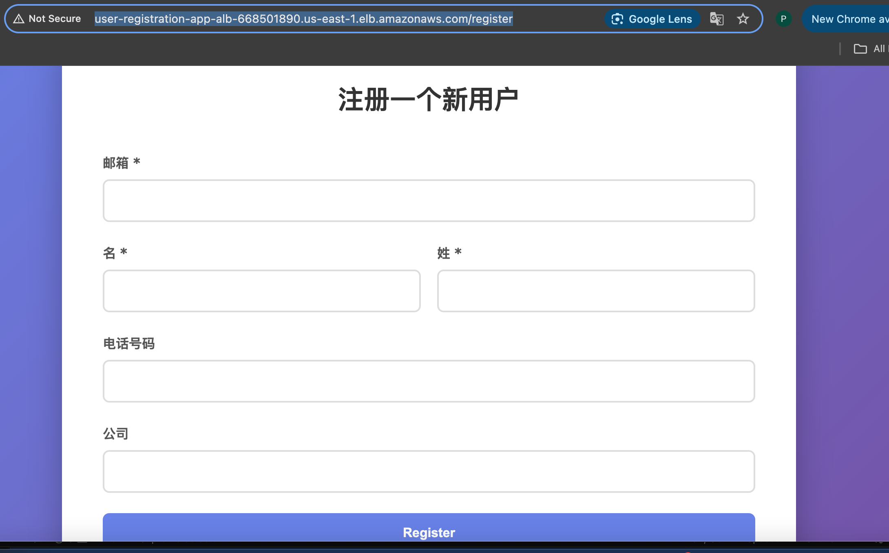

# USER-MANAGE-SYS-AWS-EKS

In this demo, I will build one user register website which frontend using flask and also with RDS for the database
Devops demo

## Features

- Terraform to create infrastructure
    - EKS module
    - IAM module
    - ECR module
    - VPC module
    - RDS module

- SRC for python flask app and frontend javascript css style

- Dockerfile 

- Deploy app to EKS

## Usage

I have written the full github actions 

- deploy.yaml 
    - create infrastructure
    - deploy apps to EKS

- destroy.yaml
    - delete the whole project

- the UI for your reference

